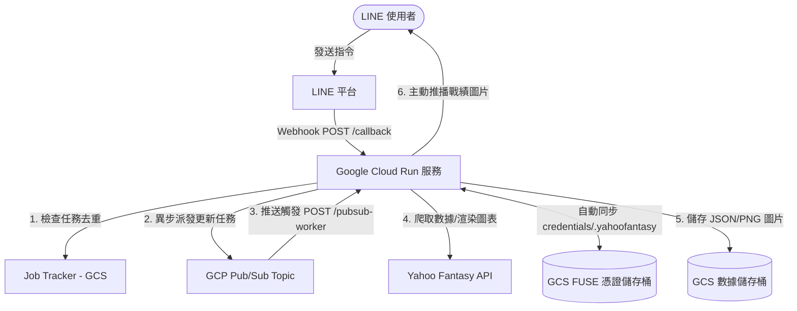

# Yahoo Fantasy NBA Scraper - 雲端部署與維護手冊 (CLOUD.md)

本文件詳列如何將本專案部署至 Google Cloud Platform (GCP) 的完整步驟、系統架構以及日常維護流程。本專案已針對 Cloud Run 的無狀態（Stateless）環境進行優化，並結合了 GCP Cloud Storage FUSE 機制來同步 Yahoo OAuth 憑證，無須修改任何 Python 程式碼即可無縫運行。

---

## 🏗️ 雲端系統架構

本專案使用 GCP Serverless 生態系構建，架構如下：



1.  **LINE 訊息接收**：使用者在 LINE 傳送指令（如 `#戰績`），觸發 LINE Webhook 送至 Cloud Run。
2.  **任務排隊與去重**：`JobTracker` 檢查當前是否有相同任務在執行，避免重複抓取。若為新任務，發送 Pub/Sub 訊息並立即向使用者回覆「更新中」。
3.  **異步背景處理**：Pub/Sub 觸發 Cloud Run 的 `/pubsub-worker` 端點，以非阻塞方式在背景執行數據爬取、圖表渲染。
4.  **FUSE 憑證同步**：透過 GCP Cloud Storage FUSE 掛載，讓 `yahoofantasy` 庫能即時读取和更新 GCS 儲存桶中的 `credentials/.yahoofantasy` 憑證檔，防止 OAuth Token 失效。
5.  **主動通知**：數據更新完畢後，主動向排隊名單中的 LINE 使用者發送 Push Message 推播戰績圖表。

---

## 📋 部署前置準備

### 1. 安裝 gcloud CLI 並登入
確保您的本機環境已安裝 `gcloud` CLI，並已驗證登入：
```bash
gcloud auth login
gcloud auth configure-docker
```

### 2. 設定目標專案
```bash
gcloud config set project [YOUR_GCP_PROJECT_ID]
```

### 3. 啟用需要的 GCP API 服務
```bash
gcloud services enable run.googleapis.com \
                       pubsub.googleapis.com \
                       storage.googleapis.com \
                       artifactregistry.googleapis.com
```

---

## 🛠️ 第一階段：Cloud Storage (GCS) 儲存桶與憑證準備

我們需要建立**兩個**儲存桶（請將 `[PROJECT_ID]` 替換為您的 GCP 專案 ID）：
*   **數據儲存桶** (`gs://yf-data-[PROJECT_ID]`)：存放 JSON 數據與產出的圖片。
*   **憑證儲存桶** (`gs://yf-credentials-[PROJECT_ID]`)：存放 Yahoo 認證所需的 `.yahoofantasy` 檔。

### 1. 建立 GCS 儲存桶
```bash
# 建立數據儲存桶
gcloud storage buckets create gs://yf-data-[PROJECT_ID] --location=asia-east1

# 建立憑證儲存桶
gcloud storage buckets create gs://yf-credentials-[PROJECT_ID] --location=asia-east1
```

### 2. 上傳現有的憑證
請確保您已在本機成功登入 Yahoo 帳戶並生成了 `credentials/.yahoofantasy`。將此檔案上傳至憑證儲存桶：
```bash
gcloud storage cp credentials/.yahoofantasy gs://yf-credentials-[PROJECT_ID]/.yahoofantasy
```

---

## ✉️ 第二階段：GCP Pub/Sub 任務主題設定

建立 Pub/Sub 主題，供 Webhook 用於發送背景異步任務：
```bash
gcloud pubsub topics create yf-updates
```

---

## 📦 第三階段：打包 Docker 映像檔並上傳

使用專案中的 `Dockerfile`，建置符合 Playwright 渲染環境的容器映像檔。

### 1. 建立 Artifact Registry 儲存庫
```bash
gcloud artifacts repositories create yf-bot-repo \
    --repository-format=docker \
    --location=asia-east1 \
    --description="Yahoo Fantasy NBA Bot Repository"
```

### 2. 建置並推送映像檔
在專案根目錄執行：
```bash
# 建置
docker build -t asia-east1-docker.pkg.dev/[PROJECT_ID]/yf-bot-repo/bot:latest .

# 推送至 GCP
docker push asia-east1-docker.pkg.dev/[PROJECT_ID]/yf-bot-repo/bot:latest
```

---

## 🚀 第四階段：部署 Cloud Run 服務 (包含 GCS FUSE 設定)

### 1. 建立並授權專屬 IAM 服務帳號
```bash
# 建立服務帳號
gcloud iam service-accounts create yf-bot-runner --display-name="YF Bot Runner"

# 授權 GCS 讀寫權限
gcloud projects add-iam-policy-binding [PROJECT_ID] \
    --member="serviceAccount:yf-bot-runner@[PROJECT_ID].iam.gserviceaccount.com" \
    --role="roles/storage.objectAdmin"

# 授權 Pub/Sub 權限
gcloud projects add-iam-policy-binding [PROJECT_ID] \
    --member="serviceAccount:yf-bot-runner@[PROJECT_ID].iam.gserviceaccount.com" \
    --role="roles/pubsub.editor"
```

### 2. 部署至 Cloud Run
請將以下指令中的 `[PROJECT_ID]`、`[YOUR_LEAGUE_ID]` 以及各項金鑰替換為實際數值：

```bash
gcloud run deploy yahoo-fantasy-bot \
    --image=asia-east1-docker.pkg.dev/[PROJECT_ID]/yf-bot-repo/bot:latest \
    --region=asia-east1 \
    --service-account=yf-bot-runner@[PROJECT_ID].iam.gserviceaccount.com \
    --allow-unauthenticated \
    --port=8080 \
    --cpu=1 \
    --memory=2Gi \
    --timeout=300 \
    --concurrency=80 \
    --execution-environment=gen2 \
    --set-env-vars=ENV=production,\
LEAGUE_ID=[YOUR_LEAGUE_ID],\
GCP_PROJECT_ID=[PROJECT_ID],\
GCS_BUCKET_NAME=yf-data-[PROJECT_ID],\
PUBSUB_TOPIC_NAME=yf-updates,\
LINE_CHANNEL_SECRET=[YOUR_LINE_CHANNEL_SECRET],\
LINE_CHANNEL_ACCESS_TOKEN=[YOUR_LINE_CHANNEL_ACCESS_TOKEN],\
YAHOO_CLIENT_ID=[YOUR_YAHOO_CLIENT_ID],\
YAHOO_CLIENT_SECRET=[YOUR_YAHOO_CLIENT_SECRET] \
    --add-volume=name=credentials-volume,type=cloud-storage,bucket=yf-credentials-[PROJECT_ID] \
    --add-volume-mount=volume=credentials-volume,mount-path=/app/credentials
```

> [!NOTE]
> **Cloud Storage FUSE 說明**：
> `--add-volume` 與 `--add-volume-mount` 指令將 GCS 儲存桶掛載至 `/app/credentials`。
> 這使容器能夠讀寫外部儲存桶，實作與本機完全相同的凭证更新邏輯，解決了 Cloud Run 無狀態重啟導致 Token 失效的問題。

---

## 🔗 第五階段：Pub/Sub Push 訂閱設定

部署成功後，您會獲得 Cloud Run 的公網 URL（例如 `https://yahoo-fantasy-bot-xxxxxx.a.run.app`）。

### 1. 建立專屬調用帳號並授權
```bash
# 建立帳號
gcloud iam service-accounts create yf-pubsub-invoker --display-name="YF PubSub Invoker"

# 授權調用 Cloud Run
gcloud run services add-iam-policy-binding yahoo-fantasy-bot \
    --region=asia-east1 \
    --member="serviceAccount:yf-pubsub-invoker@[PROJECT_ID].iam.gserviceaccount.com" \
    --role="roles/run.invoker"
```

### 2. 建立訂閱通道
將背景任務轉導至 Cloud Run 的 `/pubsub-worker` 端點：
```bash
gcloud pubsub subscriptions create yf-updates-sub \
    --topic=yf-updates \
    --push-endpoint=[CLOUD_RUN_URL]/pubsub-worker \
    --push-auth-service-account=yf-pubsub-invoker@[PROJECT_ID].iam.gserviceaccount.com
```

---

## 💬 第六階段：LINE Webhook 綁定

1.  登入 [LINE Developers Console](https://developers.line.biz/)。
2.  將 **Webhook settings** 中的 Webhook URL 設定為：
    `https://[CLOUD_RUN_URL]/callback`
3.  點擊 **Verify** 確認回傳 `Success`，並開啟 **Use webhook** 開關。

---

## 🧹 日常維護與憑證過期處理

### 1. 查看雲端日誌 (Logs)
Cloud Run 所有標準輸出（`logging.info`）都會整合至 GCP Cloud Logging。您可以使用以下指令即時追蹤日誌：
```bash
gcloud beta run services logs tail yahoo-fantasy-bot --region=asia-east1
```

### 2. 憑證完全過期（或需要重新登入授權）時的處理步驟
如果 Yahoo 憑證不幸完全失效（例如：超過一個月沒有執行任何請求，導致 Refresh Token 也過期），您可以透過以下步驟在本機重新授權並上傳：
1.  **本機登入**：在本機將環境變數切換至 `local`，執行一次主程式觸發瀏覽器授權登入流程，完成後會在本機重新生成 `credentials/.yahoofantasy`。
2.  **覆蓋 GCS 上的憑證**：將本機新生成的憑證重新上傳覆蓋 GCS 憑證儲存桶：
    ```bash
    gcloud storage cp credentials/.yahoofantasy gs://yf-credentials-[PROJECT_ID]/.yahoofantasy
    ```
3.  **重啟 Cloud Run**：上傳完成後，您可以手動重新部署或重啟 Cloud Run 服務，以確保其載入最新上傳的有效憑證：
    ```bash
    gcloud run services update yahoo-fantasy-bot --region=asia-east1
    ```
