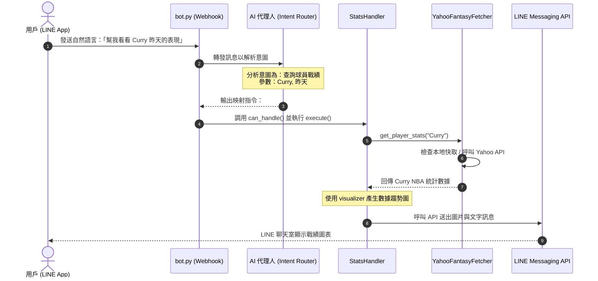

# Yahoo Fantasy NBA LINE Bot x AI 代理人互動框架

本文件展示了將 AI 代理人（AI Agent）機制導入本 Yahoo Fantasy NBA LINE Bot 專案後的實際運作與互動流程設計。

---

## 專案架構分層對應

當我們為專案導入 AI 代理人意圖解析後，整個運作架構將分為以下五個核心層次：

### 1. 用戶端 (User / LINE App)
*   **角色**：用戶在 LINE 聊天室中，使用自然語言或快捷指令輸入請求（例如：「幫我查 Curry 昨天的表現」或 `#球員戰績 Curry`）。

### 2. LINE Webhook 接收層 ([bot.py](file:///C:/Users/HsiehLink/Python/yf_for_turtle/bot.py))
*   **角色**：使用 Flask 運行於 `Port 5001` 的 Webhook Server，接收來自 LINE 平台的訊息事件，並進行初步的延遲防護與回覆 Token 管理。

### 3. AI 意圖解析路由器 ([CommandDispatcher](file:///C:/Users/HsiehLink/Python/yf_for_turtle/src/handlers/dispatcher.py))
*   **角色**：
    *   **指令匹配**：若用戶輸入為標準指令（如帶有 `#`），則直接透過 [CommandDispatcher](file:///C:/Users/HsiehLink/Python/yf_for_turtle/src/handlers/dispatcher.py) 分發。
    *   **AI 代理人解析**：若用戶輸入為自然語言，則由 AI 代理人模組介入，理解用戶意圖，並將其映射至對應的處理器指令。

### 4. 專案處理解析層 (Specialized Handlers)
根據不同的指令意圖，分派至對應的處理器執行業務邏輯：
*   [StatsHandler](file:///C:/Users/HsiehLink/Python/yf_for_turtle/src/handlers/stats_handler.py)：處理球隊與球員數據統計。
*   [PlayerHandler](file:///C:/Users/HsiehLink/Python/yf_for_turtle/src/handlers/player_handler.py)：處理球員資訊查詢與檢索。
*   [MatchupHandler](file:///C:/Users/HsiehLink/Python/yf_for_turtle/src/handlers/matchup_handler.py)：處理聯賽配對與對戰狀況。

### 5. 數據獲取與工具層 (Tools & APIs)
*   **數據抓取**：透過 [YahooFantasyFetcher](file:///C:/Users/HsiehLink/Python/yf_for_turtle/src/fetcher.py) 呼叫 Yahoo Fantasy 官方 API。
*   **資料存儲**：透過 [storage.py](file:///C:/Users/HsiehLink/Python/yf_for_turtle/src/storage.py) 進行本地 JSON 快取或讀寫。
*   **視覺化工具**：產生球員數據圖表（儲存於 `data/images/`），並以圖片訊息格式透過 LINE API 回傳。

---

## 實際互動工作流程 (Sequence Diagram)

以下以用戶輸入**「幫我看看 Curry 昨天的表現」**為例，展示 AI 代理人與專案組件的互動流程：

---

> [!NOTE]
> ### 本專案導入 AI 代理人的優勢
> 1. **自然語言友善**：用戶不再需要強記如 `#球員戰績`、`#對戰` 等固定前綴指令，可以直接進行口語化詢問。
> 2. **參數自動提取**：AI 代理人可自動從語句中抽離出「球員名稱（如 Curry）」、「時間範圍（如昨天、上週）」等參數，精準對接 Handler 的輸入。
