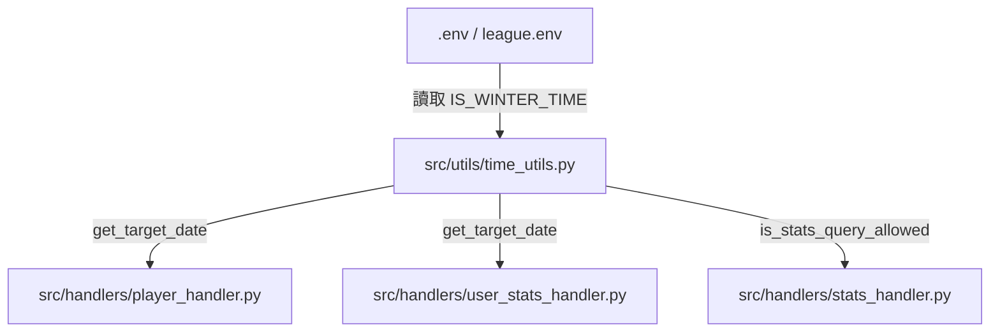

# Yahoo Fantasy NBA Scraper - 時區與時令判定重構設計規格書 (Timezone & DST Refactoring Spec)

* **日期**：2026-05-28
* **狀態**：已批准 (Approved)
* **作者**：Antigravity AI

---

## 1. 需求與目標 (Goal Description)

### 1.1 背景與痛點
目前系統在處理「跨日日期計算」與「今日戰績查詢時間限制」時，其邏輯分散在多個 Handler 中（`PlayerHandler`、`UserStatsHandler` 和 `StatsHandler`），且採用了硬編碼（Hardcoded）的方式判定時間：
* **跨日判定**：硬編碼台北時間早上 7 點為跨日點（大於等於 7 點為昨日，小於 7 點為前天）。
* **戰績查詢限制**：硬編碼台北時間下午 14 點為今日戰績更新完成的門檻。

**痛點**：美國美西時間有**夏令時間 (Daylight Saving Time, DST)** 與**冬令時間 (Standard Time, ST)** 之分。
* 夏令時期間（時差 15 小時）：跨日點應為台北時間早上 **07:00**，戰績打完點為台北時間下午 **14:00**。
* 冬令時期間（時差 16 小時）：跨日點應順延為台北時間早上 **08:00**，戰績打完點為台北時間下午 **15:00**。

目前的硬編碼無法適應時令的轉換，會導致冬令時期間查詢到不完整的當日數據，或提前抓取到空數據。

### 1.2 重構目標
1. **收攏時間判定**：將所有跨日、時區與跨夜限時邏輯從 Handler 抽離，統一由 `src/utils/time_utils.py` 管理。
2. **自動判定時令（0 耗時）**：利用 Python 本地 `pytz` 的 `US/Pacific` 時區資訊，透過微秒級的本地純代碼運算，自動偵測美西目前是冬令還是夏令，完全不呼叫任何外部 API。
3. **支援設定檔覆蓋 (CONFIG Override)**：在 `.env` / `league.env` 提供布林設定值 `IS_WINTER_TIME`，若設為 `true` 則強制作為冬令時，`false` 則強制作為夏令時，平常不設則自動判定。

---

## 2. 架構設計 (Architecture & Module Responsibilities)

重構後的模組關係如圖所示：



### 2.1 職責分配
* **`src/utils/time_utils.py`**：
  * 核心時間判定中心，實作 `is_winter_time_pacific()`。
  * 提供 `get_target_date()` 給實時球員/玩家數據查詢。
  * 提供 `is_stats_query_allowed()` 給綜合戰績限時查詢。
* **`src/handlers/player_handler.py` & `src/handlers/user_stats_handler.py`**：
  * 刪除內部重複的 `calculate_target_date`。
  * 調用 `src.utils.time_utils.get_target_date`。
* **`src/handlers/stats_handler.py`**：
  * 刪除內部 `get_tw_hour()` 定義。
  * 調用 `src.utils.time_utils.is_stats_query_allowed` 來攔截提早的即時查詢。

---

## 3. 核心 API 設計與演算法 (API & Algorithm Design)

### 3.1 `is_winter_time_pacific() -> bool`
本地極速冬夏令自動判定與覆蓋演算法。

```python
def is_winter_time_pacific() -> bool:
    """
    本地極速判斷目前美西是否為冬令時間。
    1. 優先讀取 config 中的 IS_WINTER_TIME 覆蓋設定。
    2. 自動透過 pytz 本地檢測美西 DST 偏移量（0 網路耗時，微秒級）。
    """
    from src.config import load_config
    try:
        config = load_config()
        is_winter_override = config.get("IS_WINTER_TIME")
        if is_winter_override is not None:
            if isinstance(is_winter_override, str):
                return is_winter_override.lower() in ("true", "1", "yes")
            return bool(is_winter_override)
    except Exception:
        pass

    import pytz
    from datetime import datetime
    
    pacific_tz = pytz.timezone("US/Pacific")
    now_pacific = datetime.now(pacific_tz)
    # now_pacific.dst() 在夏令時不為 0，在冬令時為 0
    is_dst = now_pacific.dst().total_seconds() != 0
    return not is_dst
```

### 3.2 `get_target_date(is_offseason: bool, end_date: str, current_tw_dt=None) -> str`
計算並回傳目標的美西日期 YYYY-MM-DD。

```python
def get_target_date(is_offseason: bool = False, end_date: str = None, current_tw_dt=None) -> str:
    """
    計算美西目標日期 YYYY-MM-DD。
    台北時間 00:00 ~ cross_hour (夏令7點/冬令8點) -> 目標為 台北日期 - 2天。
    台北時間 cross_hour ~ 24:00 -> 目標為 台北日期 - 1天。
    """
    from datetime import datetime, timedelta
    import pytz
    
    if is_offseason:
        return end_date or "2026-04-12"
        
    if current_tw_dt is None:
        tw_tz = pytz.timezone("Asia/Taipei")
        current_tw_dt = datetime.now(tw_tz)
        
    tw_date = current_tw_dt.date()
    tw_hour = current_tw_dt.hour
    
    # 依時令決定台北時間的跨日判定點 (冬令8點，夏令7點)
    cross_hour = 8 if is_winter_time_pacific() else 7
    
    if tw_hour >= cross_hour:
        target_dt = tw_date - timedelta(days=1)
    else:
        target_dt = tw_date - timedelta(days=2)
        
    return target_dt.strftime("%Y-%m-%d")
```

### 3.3 `is_stats_query_allowed(is_offseason: bool) -> tuple[bool, str]`
統一綜合戰績限時查詢判定，回傳 `(是否允許, 提示訊息)`。

```python
def is_stats_query_allowed(is_offseason: bool = False) -> tuple[bool, str]:
    """
    今日綜合戰績限制在美西打完比賽後才能查詢。
    夏令台北時間 14:00 後允許，冬令台北時間 15:00 後允許。
    """
    from datetime import datetime
    import pytz
    
    if is_offseason:
        return True, ""
        
    allow_hour = 15 if is_winter_time_pacific() else 14
    
    tw_tz = pytz.timezone("Asia/Taipei")
    tw_hour = datetime.now(tw_tz).hour
    
    if tw_hour < allow_hour:
        return False, f"請於 {allow_hour}:00 後再進行查詢。"
    return True, ""
```

---

## 4. 驗證與測試計畫 (Verification Plan)

為確保時區重構不影響任何現有業務，我們將採取「自動化測試」與「人工快取驗證」雙重機制。

### 4.1 自動化單元測試 (`pytest`)
我們將建立 `tests/test_time_utils_timezone.py`，撰寫針對性極強的測試：
1. **Mock 時區與覆蓋參數**：
   * 模擬 `load_config` 回傳 `IS_WINTER_TIME = True`，驗證 `is_winter_time_pacific()` 回傳 `True`。
   * 模擬 `load_config` 回傳 `IS_WINTER_TIME = False`，驗證 `is_winter_time_pacific()` 回傳 `False`。
2. **夏令時 (cross_hour = 7) 邊界測試**：
   * 模擬當前時間為夏令時，台北時間 `06:59` 👉 `get_target_date` 回傳 `Day - 2`。
   * 模擬當前時間為夏令時，台北時間 `07:01` 👉 `get_target_date` 回傳 `Day - 1`。
3. **冬令時 (cross_hour = 8) 邊界測試**：
   * 模擬當前時間為冬令時，台北時間 `07:59` 👉 `get_target_date` 回傳 `Day - 2`。
   * 模擬當前時間為冬令時，台北時間 `08:01` 👉 `get_target_date` 回傳 `Day - 1`。
4. **戰績限時查詢邊界測試**：
   * 夏令時下午 `13:59` 查詢 👉 不允許，回覆 `請於 14:00 後...`。
   * 冬令時下午 `14:59` 查詢 👉 不允許，回覆 `請於 15:00 後...`。

### 4.2 整合測試
重構完成後，執行專案內全部單元測試，確保原有 86 個單元測試均不受影響，且保持 100% 通過。
