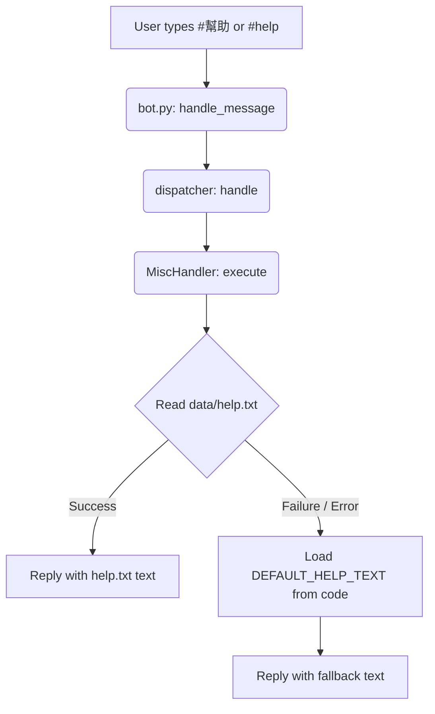

# Design Spec: LINE Bot #幫助/#help Command Implementation

## 1. Context & Purpose
The `yf_for_turtle` LINE Bot has a placeholder for `#幫助` and `#help` (and case variations) within the `MiscHandler`.
Currently, this command only prints a placeholder log and does not reply to users.
This specification outlines the implementation to dynamically read and return the contents of the UTF-8 text file `data/help.txt`.
It also details a robust fallback mechanism (Approach A) to handle cases where the file cannot be accessed or read.

## 2. User Requirements
- **Command Trigger:** Matches `^#(?:幫助|help|[hH][eE][lL][pP])$` (case-insensitive for "help", whitespace stripped).
- **Core Functionality:** Reads and replies with the contents of `C:\Users\HsiehLink\Python\yf_for_turtle\data\help.txt`.
- **Text Format:** Plain text formatted with emojis, with no Markdown markers (e.g. `*`, `_`, `#`, `-`) to ensure perfect legibility in the LINE app client.
- **Robustness Requirement:** If the file `data/help.txt` is missing or fails to load, the bot must reply with a hardcoded fallback summary of essential commands to avoid dead silent failures.

## 3. Architecture & Data Flow



## 4. Components & Implementation Details

### 4.1 File Location Resolution
The path `data/help.txt` must be resolved using absolute path mapping relative to the location of `misc_handler.py`. This ensures it works reliably regardless of the working directory (CWD) from which `bot.py` is executed:
```python
project_root = os.path.dirname(os.path.dirname(os.path.dirname(os.path.abspath(__file__))))
help_file_path = os.path.join(project_root, "data", "help.txt")
```

### 4.2 Handling encoding
`help.txt` contains Traditional Chinese characters. It must be read using `utf-8` encoding explicitly to avoid platform-specific encoding errors (e.g. `cp950` on Windows):
```python
with open(help_file_path, "r", encoding="utf-8") as f:
    help_content = f.read()
```

### 4.3 Robust Fallback (Approach A)
Inside `_handle_help`, a constant fallback text `DEFAULT_HELP_TEXT` is defined. This plain text provides basic command usage without any markdown markers:
```python
DEFAULT_HELP_TEXT = (
    "👋 您好！歡迎使用聯賽數據助手。\n\n"
    "【常用指令】\n"
    "● #戰績 ：查詢當日聯賽綜合戰績\n"
    "● #對戰 肥儒 ：查詢指定玩家當週即時 9-Cat 對決\n"
    "● #玩家 肥儒 ：查詢指定玩家今日累積數據與排名\n"
    "● #球員 老詹 ：查詢指定球員今日即時比賽表現\n\n"
    "※ 提示：輸入「#幫助」可獲取完整的指令複製清單。"
)
```

## 5. Testing Plan

### 5.1 Success Scenario Test (`test_execute_help_success`)
- **Setup:** Mock `builtins.open` to successfully return a dummy help string (e.g., "Mocked Help Content").
- **Trigger:** Send `#幫助` text message.
- **Verification:** Ensure `MessagingApi.reply_message` is called with a `TextMessage` containing the exact "Mocked Help Content" string.

### 5.2 Fallback Scenario Test (`test_execute_help_fallback`)
- **Setup:** Mock `builtins.open` to raise a `FileNotFoundError` or `OSError`.
- **Trigger:** Send `#help` text message.
- **Verification:** Ensure `MessagingApi.reply_message` is called with a `TextMessage` containing the exact `DEFAULT_HELP_TEXT` fallback string.
