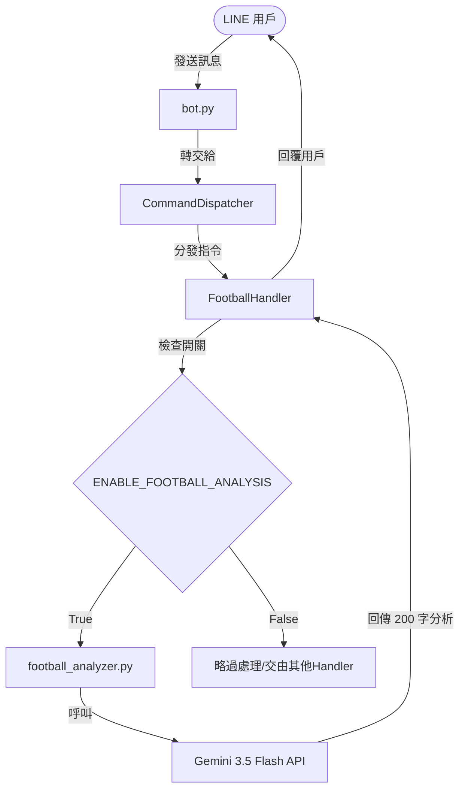

# 2026-06-16 世界盃臨時功能：足球對戰分析設計規格書

本規格書詳細說明如何在 LINE Bot 中新增一個臨時的足球對戰分析功能，讓用戶輸入 `#足球 球隊A 球隊B` 時，透過 Gemini 3.5 Flash 的專業足球知識對兩隊進行 200 字左右的對戰分析。

---

## 1. 背景與目標

* **背景**：為了配合世界盃活動，提供用戶臨時性的足球對戰預測與分析服務。
* **目標**：
  * 用戶輸入 `#足球 <球隊A> <球隊B>`（如 `#足球 巴西 德國`）時，系統能調用 Gemini API 生成對戰分析。
  * 該功能為**臨時功能**，必須能藉由修改環境變數設定關閉。
  * 設計需遵循「職責分離」原則，以便在世界盃結束後能輕鬆且乾淨地將此功能移除。

---

## 2. 環境配置 (Configuration)

在環境變數 `.env` 中加入功能開關：

```ini
# 世界盃臨時功能：足球對戰分析 (True: 開啟, False: 關閉)
ENABLE_FOOTBALL_ANALYSIS=True
```

在 [src/config.py](file:///C:/Users/HsiehLink/Python/yf_for_turtle/src/config.py) 中，將此環境變數讀入系統設定中，並自動轉為布林值（若無設定，預設為 `False`）：

```python
# src/config.py 內部載入邏輯
"ENABLE_FOOTBALL_ANALYSIS": os.getenv("ENABLE_FOOTBALL_ANALYSIS", "False").lower() in ("true", "1", "yes")
```

---

## 3. 架構設計

為了與既有的 NBA 數據查詢功能解耦，本功能採用 **方案 A：獨立模組架構**。



### 3.1 檔案變更列表
* **新增** [src/utils/football_analyzer.py](file:///C:/Users/HsiehLink/Python/yf_for_turtle/src/utils/football_analyzer.py)：封裝呼叫 Gemini 3.5 Flash 的對戰分析 Prompt。
* **新增** [src/handlers/football_handler.py](file:///C:/Users/HsiehLink/Python/yf_for_turtle/src/handlers/football_handler.py)：處理指令 Regex 匹配、開關檢查、球隊解析及 LINE 訊息回覆。
* **修改** [bot.py](file:///C:/Users/HsiehLink/Python/yf_for_turtle/bot.py)：註冊 `FootballHandler`。
* **新增** [tests/test_football_analyzer.py](file:///C:/Users/HsiehLink/Python/yf_for_turtle/tests/test_football_analyzer.py) 與 [tests/test_football_handler.py](file:///C:/Users/HsiehLink/Python/yf_for_turtle/tests/test_football_handler.py)：針對分析器與處理器做單元測試。

---

## 4. 詳細設計

### 4.1 指令正規表達式 (Regex)
為提供「靈活相容模式」，我們使用以下正則表達式解析用戶輸入：

```python
# 支援空格、vs、VS、對、對戰作為兩隊的分隔符
self.pattern = re.compile(r"^#足球\s+(\S+)\s*(?:vs|VS|對|對戰|\s)\s*(\S+)$")
```
* **測試匹配案例**：
  * `#足球 巴西 德國` ➔ 提取為 `巴西` 與 `德國`
  * `#足球 巴西vs德國` ➔ 提取為 `巴西` 與 `德國`
  * `#足球 巴西 對 德國` ➔ 提取為 `巴西` 與 `德國`

### 4.2 LLM 分析器與 Prompt 設計
在 `src/utils/football_analyzer.py` 中，我們定義呼叫 Gemini API 的邏輯：

```python
def analyze_football_matchup(team_a: str, team_b: str, api_key: str = None, model_name: str = None) -> str:
    # 讀取金鑰與模型設定
    # 呼叫 Gemini 3.5 Flash
```

* **System Instruction (系統提示詞)**：
  ```text
  你是一個專業的足球 analysis 元（分析員）。
  請針對使用者提供的兩支足球隊伍進行專業的對戰分析。
  請遵循以下嚴格限制：
  1. 必須結合你所知道的最新足球數據與資訊進行分析（例如兩隊的實力對比、球星陣容、近期狀態等）。
  2. 不要報導或引用新聞，請完全根據你自己的專業足球知識進行獨立分析。
  3. 分析內容大約在 200 字左右，字數不可過長，使用繁體中文。
  4. 不要包含額外的 Markdown 標題或多餘的引言，直接給出分析內容。
  ```

* **User Prompt (使用者輸入)**：
  ```text
  請為以下兩支球隊進行對戰分析：{team_a} vs {team_b}
  ```

### 4.3 處理器執行邏輯
在 `src/handlers/football_handler.py` 的 `execute` 方法中：
1. 用戶送出指令後，Bot 第一時間回覆「🔍 正在為您分析 {team_a} 與 {team_b} 的對戰，請稍候...」（避免 LINE API 逾時並給予用戶視覺回饋）。
2. 在背景非同步或同步執行 `analyze_football_matchup(team_a, team_b)`。
3. 取得分析結果後，透過 LINE API 送出 analysis 文字。
4. 若 `ENABLE_FOOTBALL_ANALYSIS` 設為 `False`，則 `can_handle` 判定為 `False`，不進行任何處理。

---

## 5. 測試計畫

我們將針對此功能編寫完整的單元測試，確保其與其他功能相安無事。

1. **Football Handler 測試** (`tests/test_football_handler.py`)：
   * 測試當開關為 `False` 時，`can_handle` 不應響應任何 `#足球` 指令。
   * 測試當開關為 `True` 時，`can_handle` 能精準匹配各種分隔符號（空格, vs, 對...）。
   * 測試 `execute` 是否能正常提取兩隊，並調用分析器。

2. **Football Analyzer 測試** (`tests/test_football_analyzer.py`)：
   * 模擬 (Mock) Gemini API 的回傳，驗證 `analyze_football_matchup` 函數是否能正確調用與處理回傳字串。
   * 驗證無 API 金鑰時的防呆處理。
