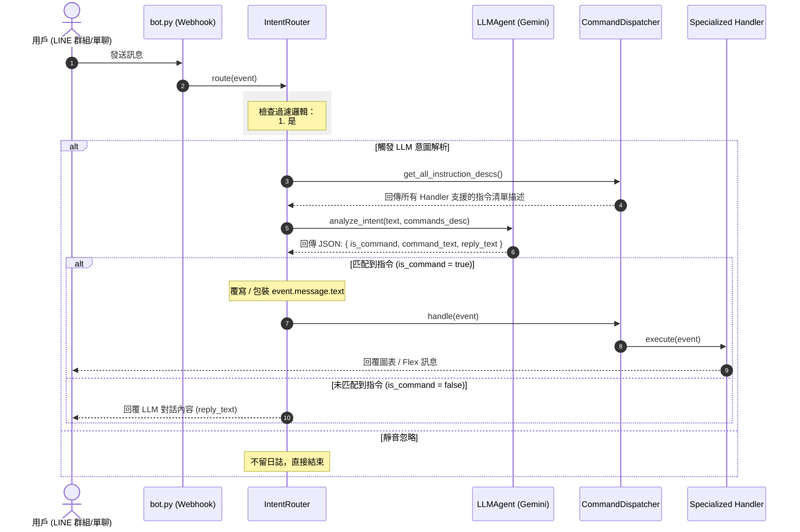

# LINE Bot 整合 LLM 意圖路由器與對話系統設計說明書

本設計文件定義了如何為 Yahoo Fantasy NBA LINE Bot 導入基於 Google Gemini API 的 AI 意圖解析路由器（Intent Router）。此功能可讓用戶以自然語言進行日常查詢，並在背後自動轉化為現有的機器人指令執行，或直接與 LLM 聊天。

---

## 1. 系統架構與流程

本專案採用 **「雙層路由器架構」**。當 LINE Webhook 收到文字訊息時，不直接進行指令分發，而是先經由 `IntentRouter` 中介層判定處理方式。

### 1.1 系統元件職責

| 元件名稱 | 模組路徑 | 職責說明 |
| :--- | :--- | :--- |
| **Webhook 接收器** | `bot.py` | 接收 LINE 訊息事件，執行基礎防護（如延遲防護），並將訊息遞交給 `IntentRouter`。 |
| **意圖路由器** | `src/handlers/intent_router.py` | 1. 識別並攔截標準的 `#` 指令。<br>2. 判定當前聊天類型（單聊或群聊）及 `@提及` 狀態。<br>3. 過濾無效訊息，並將有效對話傳遞給 `LLMAgent`。<br>4. 整合與路由執行結果。 |
| **指令分發器** | `src/handlers/dispatcher.py` | 維持原有邏輯，負責收集並管理所有已註冊的 Handlers，並根據標準指令匹配與分派任務。 |
| **LLM 代理人** | `src/utils/llm_agent.py` | 封裝 Google Gemini API，載入動態指令清單，分析用戶意圖並回傳結構化 JSON 資料。 |
| **基礎處理器** | `src/handlers/base_handler.py` | 定義統一接口，新增 `instruction_desc` 屬性，供各個 Handler 動態宣告支援的指令。 |

### 1.2 訊息處理與路由流向 (Sequence Diagram)



---

## 2. 詳細設計細節

### 2.1 LINE @提及 (Mention) 與日誌減噪策略

為了避免在多人群組中因大量閒聊導致日誌爆滿或頻繁調用 API，`IntentRouter` 將實施嚴格的過濾：
*   **群聊提及判定條件**：
    1.  **官方 Mention 欄位**：檢查 `event.message.mention.mentionees`，必須包含非 `type == "all"` 的提及目標（即確認有 @ 機器人本人，排除 `@ALL`）。
    2.  **文字喚醒詞備用**：若文字中手動輸入包含 `@bot` 或 `@linebot`（不分大小寫），亦視同提及。
*   **Log 減噪**：
    *   僅在訊息**確定需要被處理**（為 `#` 指令、單聊、或群組中符合 @提及）時，才印出接收訊息日誌。
    *   其他群組閒聊直接 return，不印出任何 Log。

### 2.2 動態指令清單注入設計 (OCP)

為了讓未來新增或修改指令時不需動手調整 LLM 的 System Prompt，指令清單將動態收集：

1.  **`BaseHandler`** 擴充：
    ```python
    @property
    def instruction_desc(self) -> str:
        """Return a user-friendly instruction format description."""
        return ""
    ```
2.  **現有 Handler** 覆寫 `instruction_desc`：
    *   `StatsHandler`：宣告 `#戰績` 相關的各種時間與週數用法。
    *   `MatchupHandler`：宣告 `#對戰` 相關用法。
    *   `PlayerHandler`：宣告 `#球員` 相關用法。
3.  **`CommandDispatcher`** 收集：
    透過 `get_all_instruction_descs()` 遍歷註冊的 Handlers，動態組裝成文本作為 System Prompt 的 `{commands_desc}`。

### 2.3 LLMAgent Prompt 設計與結構化輸出

*   **模型選擇**：預設使用 `gemini-1.5-flash`（可依環境變數配置切換至 `gemini-2.5-flash`），配置 `temperature=0.2`。
*   **強制 JSON 輸出**：設定 `response_mime_type="application/json"`。
*   **JSON 綱要 (Schema)**：
    ```json
    {
      "type": "object",
      "properties": {
        "is_command": { "type": "boolean" },
        "command_text": { "type": ["string", "null"] },
        "reply_text": { "type": ["string", "null"] }
      },
      "required": ["is_command", "command_text", "reply_text"]
    }
    ```

---

## 3. 錯誤處理與邊界情況

1.  **環境變數缺失**：
    若 `.env` 中未配置 `GEMINI_API_KEY`，`LLMAgent` 將記錄警告日誌，並對用戶非指令的詢問回覆「系統目前未配置 AI 金鑰，無法為您服務」，而標準的 `#` 指令將照常運作不受影響。
2.  **Gemini 服務超時或中斷**：
    若呼叫 Gemini API 失敗，程式捕獲 Exception 並記錄 Error Log，回覆用戶「我的大腦暫時離線了，請稍後再試！」，防止 Webhook 崩潰。
3.  **LINE 官方物件唯讀防護**：
    在 python-line-bot-sdk 中，若 `event.message.text` 屬性因 Frozen 或 Slot 限制無法直接覆寫，`IntentRouter` 將會使用動態包裝器 `TextMessageWrapper` 對 `event.message` 進行安全包裹，確保 Dispatcher 能正常讀取轉化後的指令。

---

## 4. 測試計畫

1.  **單體測試 (Unit Tests)**：
    *   測試 `IntentRouter` 的過濾邏輯：確保單聊會觸發、群聊 `@bot` 會觸發、群聊普通對話與 `@ALL` 被靜音忽略且不印 Log。
    *   測試動態指令清單注入：驗證 `CommandDispatcher.get_all_instruction_descs()` 輸出的正確性。
    *   測試 `LLMAgent` 的意圖分類：模擬 Gemini API 回傳，驗證 JSON 解析與錯誤降級。
2.  **集成測試 (Integration Tests)**：
    *   使用 Mock Event 模擬用戶輸入自然語言「幫我看看小謝這週打得怎樣」，確認能自動調用 `MatchupHandler` 并回覆對戰資訊。
