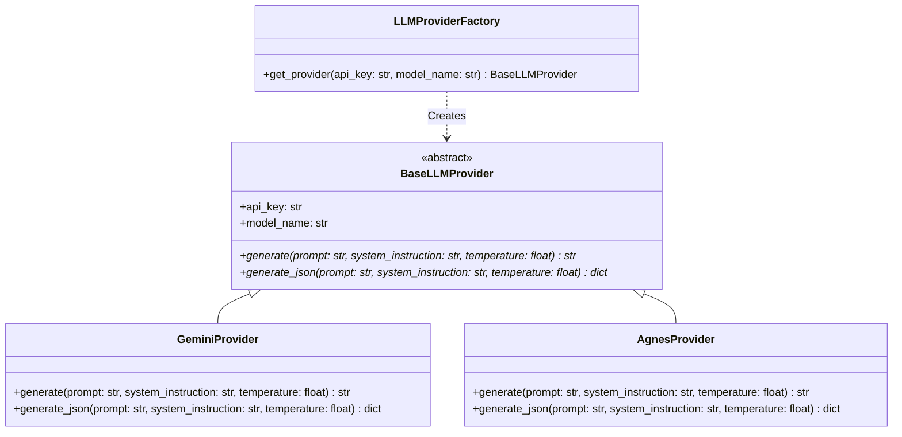

# Spec: LLM Dynamic Provider Pattern Refactoring

This specification outlines the plan to refactor the LLM (Large Language Model) integration within the Yahoo Fantasy LINE Bot. The goal is to replace hardcoded, model-specific conditions (for Agnes AI and Google Gemini) with a clean **Factory & Provider Pattern**, making the system fully configurable via generic environment variables (`LLM_API_KEY` and `LLM_MODEL`).

---

## 1. Background & Goals

Currently, several utility files (`llm_agent.py`, `gemini_parser.py`, `football_analyzer.py`) contain duplicate `if/else` logic to check if a model contains the string `"agnes"`. This creates code duplication and high coupling. Additionally, legacy environment variables (like `GEMINI_API_KEY`) clutter configuration.

### Goals
- **Single Source of Truth for Configuration**: Remove all hardcoded fallbacks and prefix-specific variables (`GEMINI_API_KEY`, `GEMINI_MODEL`). Rely purely on `LLM_API_KEY` and `LLM_MODEL`.
- **Decoupling**: Isolate API/SDK specific code (such as HTTP `requests` for Agnes and `google-generativeai` SDK for Gemini) into dedicated provider classes.
- **Factory Pattern**: Centralize routing logic in a Factory class. Other modules request a generic `BaseLLMProvider` interface and invoke unified generation methods.
- **Zero Default Assumption**: If `LLM_MODEL` or `LLM_API_KEY` is missing from the environment, raise a clear configuration error instead of defaulting to a model like `gemini-2.5-flash`.

---

## 2. System Architecture & File Structure

We will introduce a new directory `src/utils/llm` to isolate provider logics:

```
src/
└── utils/
    └── llm/
        ├── __init__.py      # Exports factory and interface
        ├── base.py          # Abstract Base Class BaseLLMProvider
        ├── gemini.py        # GeminiProvider using google.generativeai
        ├── agnes.py         # AgnesProvider using requests API
        └── factory.py       # LLMProviderFactory for dynamic routing
```

### UML Class Diagram



---

## 3. Interfaces & Implementation Specs

### 3.1 `BaseLLMProvider`
Located in [base.py](file:///C:/Users/HsiehLink/Python/yf_for_turtle/src/utils/llm/base.py):

```python
from abc import ABC, abstractmethod

class BaseLLMProvider(ABC):
    def __init__(self, api_key: str, model_name: str):
        self.api_key = api_key
        self.model_name = model_name

    @abstractmethod
    def generate(self, prompt: str, system_instruction: str = None, temperature: float = 0.2) -> str:
        """Sends a plain text prompt and returns the string response."""
        pass

    @abstractmethod
    def generate_json(self, prompt: str, system_instruction: str = None, temperature: float = 0.2) -> dict:
        """Sends a prompt and returns a parsed JSON dictionary."""
        pass
```

### 3.2 `LLMProviderFactory`
Located in [factory.py](file:///C:/Users/HsiehLink/Python/yf_for_turtle/src/utils/llm/factory.py):

```python
import os
from .base import BaseLLMProvider

class LLMProviderFactory:
    @staticmethod
    def get_provider(api_key: str = None, model_name: str = None) -> BaseLLMProvider:
        key = api_key or os.getenv("LLM_API_KEY")
        model = model_name or os.getenv("LLM_MODEL")
        
        if not key:
            raise ValueError("LLM API key (LLM_API_KEY) is not configured in the environment.")
        if not model:
            raise ValueError("LLM Model (LLM_MODEL) is not configured in the environment.")
            
        model_lower = model.lower()
        if "agnes" in model_lower:
            from .agnes import AgnesProvider
            return AgnesProvider(api_key=key, model_name=model)
        else:
            from .gemini import GeminiProvider
            return GeminiProvider(api_key=key, model_name=model)
```

---

## 4. Integration Plan for Existing Modules

### 4.1 Update Config Module
In [src/config.py](file:///C:/Users/HsiehLink/Python/yf_for_turtle/src/config.py), completely remove any loading or exposing of `GEMINI_API_KEY` and `GEMINI_MODEL` from default environments, simplifying to:
```python
        "LLM_API_KEY": os.getenv("LLM_API_KEY"),
        "LLM_MODEL": os.getenv("LLM_MODEL"),
```

### 4.2 Update `LLMAgent`
In [src/utils/llm_agent.py](file:///C:/Users/HsiehLink/Python/yf_for_turtle/src/utils/llm_agent.py):
```python
from .llm.factory import LLMProviderFactory

class LLMAgent:
    def __init__(self):
        self.provider = LLMProviderFactory.get_provider()
        self.system_prompt = "..." # System instructions for intent routing

    def analyze_intent(self, text: str, commands_desc: str) -> dict:
        prompt = f"{self.system_prompt.replace('{commands_desc}', commands_desc)}\n\n用戶輸入：{text}"
        try:
            return self.provider.generate_json(prompt, temperature=0.2)
        except Exception as e:
            # Handle general/timeout/structure failure logs and friendly line replies
            ...
```

### 4.3 Update `gemini_parser.py`
In [src/utils/gemini_parser.py](file:///C:/Users/HsiehLink/Python/yf_for_turtle/src/utils/gemini_parser.py):
```python
from .llm.factory import LLMProviderFactory

def parse_player_nickname(nickname: str, api_key: str = None, model_name: str = None) -> dict:
    try:
        provider = LLMProviderFactory.get_provider(api_key, model_name)
        data = provider.generate_json(f"請解析以下輸入：{nickname}", SYSTEM_PROMPT)
        
        if not data.get("is_known_player"):
            # Execute DuckDuckGo search and prompt fallback
            ...
            data_search = provider.generate_json(prompt, "你是一個精準的 NBA 籃球專家。")
            return data_search
        return data
    except Exception as e:
        ...
```

### 4.4 Update `football_analyzer.py`
In [src/utils/football_analyzer.py](file:///C:/Users/HsiehLink/Python/yf_for_turtle/src/utils/football_analyzer.py):
```python
from .llm.factory import LLMProviderFactory

def analyze_football_matchup(team_a: str, team_b: str, api_key: str = None, model_name: str = None) -> str:
    try:
        provider = LLMProviderFactory.get_provider(api_key, model_name)
        prompt = f"請為以下兩支球隊進行對戰分析：{team_a} vs {team_b}"
        return provider.generate(prompt, system_instruction=SYSTEM_PROMPT)
    except Exception as e:
        ...
```

---

## 5. Testing & Verification Strategy

### 5.1 Unit Tests for the Factory & Providers
We will write [tests/test_llm_factory.py](file:///C:/Users/HsiehLink/Python/yf_for_turtle/tests/test_llm_factory.py):
- Verify that `LLMProviderFactory.get_provider()` throws ValueError if `LLM_API_KEY` or `LLM_MODEL` is missing.
- Verify that it returns an `AgnesProvider` if the model contains `"agnes"`.
- Verify that it returns a `GeminiProvider` otherwise.
- Mock external network requests/SDK calls for individual providers (`GeminiProvider` and `AgnesProvider`) to verify they conform to abstract interfaces.

### 5.2 Refactor Existing Test Suites
- Update environment variables in existing tests (`tests/test_llm_agent.py`, `tests/test_gemini_parser.py`, `tests/test_football_analyzer.py`, `tests/test_player_handler.py`) to mock/set `LLM_API_KEY` and `LLM_MODEL` instead of `GEMINI_API_KEY`/`GEMINI_MODEL`.
- Run the full suite `python -m pytest` to guarantee zero regressions.
