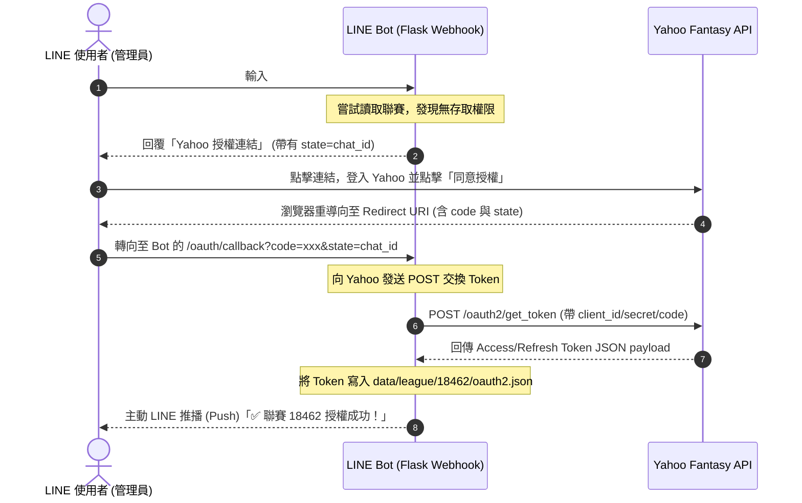

# 多聯盟 Web-based Yahoo OAuth 授權與隔離設計文件

此設計文件定義了 Yahoo Fantasy NBA LINE Bot 中實作「Web-based Yahoo OAuth 授權流」與「聯賽級別憑證隔離」的設計與技術規格。此功能可讓使用者直接在手機 LINE 上完成 Yahoo 帳號的授權，並將生成的 Access/Refresh Token 綁定隔離至對應聯賽的資料目錄中。

## 1. 核心需求與規格

1. **憑證路徑物理隔離**：各聯賽使用的 Yahoo 憑證 `oauth2.json` 必須獨立儲存於各聯賽的專屬目錄 `data/league/<LEAGUE_ID>/oauth2.json`。
2. **預設憑證繼承（Fallback）**：若新綁定的聯賽尚未在本地進行過專屬 OAuth 授權，且 `data/league/<LEAGUE_ID>/oauth2.json` 還不存在，系統預設會從全域 `credentials/oauth2.json` 複製一份作為初始憑證，避免管理員重複授權能存取的聯賽。
3. **無權限授權導引**：若聯賽存取發生 `LeaguePermissionError`，Bot 將回覆一則包含專屬 **Yahoo 授權超連結** 的訊息給使用者。
4. **Flask 回呼端點與 Token 交換**：在 Flask 中新增 `/oauth/callback` 路由，接收 Yahoo 重導向帶回的 `code`，向 Yahoo 伺服器交換 Token，並寫入該聊天室所綁定聯賽的專屬憑證檔。
5. **主動推播開通通知**：在 Token 交換成功後，Bot 使用 LINE 推播（Push Message）功能，主動通知對應聊天室（`chat_id`）授權成功與服務開通。

---

## 2. 系統架構與流程

### 2.1 授權與綁定循序圖



---

## 3. 詳細技術規格

### 3.1 憑證路徑解析變更 ([fetcher.py](file:///C:/Users/HsiehLink/Python/yf_for_turtle/src/fetcher.py))
重構 `YahooFantasyFetcher` 中 `yahoofantasy.Context` 的初始化：
* **動態目錄決定**：
  若傳入 `league_id`，則其憑證目錄為 `data/league/<LEAGUE_ID>/`。
* **憑證初始化繼承**：
  若目標 `data/league/<LEAGUE_ID>/oauth2.json` 不存在，且全域 `credentials/oauth2.json` 存在，則自動將其複製到目標目錄下作為預設憑證。
```python
# 範例邏輯
import shutil
global_cred = os.path.join(BASE_DIR, "credentials", "oauth2.json")
target_dir = os.path.join(BASE_DIR, "data", "league", league_id)
target_cred = os.path.join(target_dir, "oauth2.json")

if not os.path.exists(target_cred) and os.path.exists(global_cred):
    os.makedirs(target_dir, exist_ok=True)
    shutil.copy2(global_cred, target_cred)
```

### 3.2 授權連結生成 ([fetcher.py](file:///C:/Users/HsiehLink/Python/yf_for_turtle/src/fetcher.py))
當發生 `LeaguePermissionError` 時，在錯誤攔截器或 BaseHandler 中生成授權網址：
* **API 參數組裝**：
  * `client_id`：本專案之 Yahoo Client ID。
  * `redirect_uri`：格式為 `https://<NGROK網域>/oauth/callback`。
  * `response_type`：固定為 `code`。
  * `state`：填入當前的 `chat_id`（作為追蹤來源的 Context）。

```python
def generate_yahoo_auth_url(client_id: str, server_url: str, chat_id: str) -> str:
    redirect_uri = f"{server_url.rstrip('/')}/oauth/callback"
    return (
        "https://api.login.yahoo.com/oauth2/request_auth"
        f"?client_id={client_id}"
        f"&redirect_uri={redirect_uri}"
        f"&response_type={code}"
        f"&state={chat_id}"
    )
```

### 3.3 Flask 路由 `/oauth/callback` ([bot.py](file:///C:/Users/HsiehLink/Python/yf_for_turtle/bot.py))
在 Flask App 中註冊新的 GET 端點 `/oauth/callback`：
1. **參數讀取**：
   * 取得 `code = request.args.get("code")`
   * 取得 `chat_id = request.args.get("state")`
2. **Token 交換請求**：
   使用 `requests` 庫向 `https://api.login.yahoo.com/oauth2/get_token` 發送 POST 請求：
   * **Headers**：`Content-Type: application/x-www-form-urlencoded`
   * **Body (data)**：
     ```python
     {
         "client_id": YAHOO_CLIENT_ID,
         "client_secret": YAHOO_CLIENT_SECRET,
         "redirect_uri": f"{SERVER_URL}/oauth/callback",
         "code": code,
         "grant_type": "authorization_code"
     }
     ```
3. **憑證寫入**：
   * 讀取並解析 Yahoo 回傳的 JSON。
   * 自 `chat_league_mapping.json` 中，以 `chat_id` 尋找其綁定的 `LEAGUE_ID`。
   * 將 JSON 內容儲存至 `data/league/<LEAGUE_ID>/oauth2.json`。
4. **主動推播回覆 (Push Notification)**：
   利用 LINE `MessagingApi` 中的 `push_message`，向 `chat_id` 推送開通通知：
   > `✅ Yahoo 帳號授權成功！已成功啟用此聊天室對聯賽 [LEAGUE_ID] 的資料存取功能。`
5. **網頁畫面響應**：
   回傳一個簡約美觀的 HTML 響應頁面提示使用者：「**授權成功，請回到 LINE 聊天室開始使用！**」。

---

## 4. 單元測試規劃

1. **憑證目錄動態解析測試**：
   * 驗證 `YahooFantasyFetcher` 初始化時，確實將 Context 的 `persist_key` 指向正確的聯賽隔離目錄。
   * 驗證未有專屬憑證時，正確繼承全域憑證。
2. **OAuth Callback 端點測試**：
   * 模擬向 `/oauth/callback` 發送帶有 `code` 與 `state` 的請求。
   * Mock `requests.post` Token 交換回應。
   * 驗證對應的 `oauth2.json` 檔案是否被成功建立，且 `push_message` 被正確調用。
3. **無權限導引連結測試**：
   * 模擬 API 存取拋出 `LeaguePermissionError`，驗證 Handler 能正確產生包含當前 `chat_id` 的授權連結並回覆。
