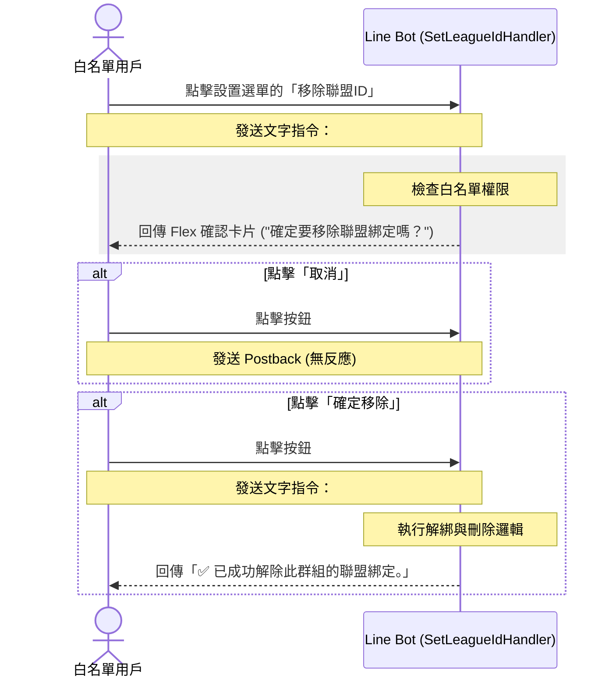

# 設計規格書：移除聯盟ID功能

## 1. 目的
實作白名單用戶專用的「移除聯盟ID」功能。提供用戶在 LINE 對話中解除當前對話框（群組/房間/個人對話）的 Yahoo 聯盟綁定，並在無其他對話框綁定該聯盟時，自動清除該聯盟的所有本地快取與暫存數據，以節省伺服器空間。

## 2. 操作流程與 UI/UX 設計



### 2.1 設置選單變更
更新 [`src/handlers/settings_handler.py`](file:///C:/Users/HsiehLink/Python/yf_for_turtle/src/handlers/settings_handler.py) 中的選單按鈕：
*   原本：`("移除聯盟ID (即將推出)", "")`
*   變更後：`("移除聯盟ID", "#移除聯盟ID")`

### 2.2 二次確認卡片 (`#移除聯盟ID`)
由 `SetLeagueIdHandler` 產生並回覆，卡片規格：
*   **標題 (Title)**：`確定要移除聯盟綁定嗎？`
*   **副標題 (Subtitle)**：無 (None)
*   **按鈕一 (Button 1)**：
    *   標籤：`確定移除`
    *   動作類型：`message`
    *   文字值：`#確定移除聯盟ID`
*   **按鈕二 (Button 2)**：
    *   標籤：`取消`
    *   動作類型：`postback`
    *   資料：`action=ignore` (點選後無反應)

---

## 3. 詳細解綁與刪除邏輯

### 3.1 攔截指令
`SetLeagueIdHandler` 將擴充其 `can_handle` 判定：
```python
def can_handle(self, user_text: str) -> bool:
    text = user_text.strip()
    return (
        text.startswith("#設置聯盟ID") or 
        text == "#移除聯盟ID" or 
        text == "#確定移除聯盟ID"
    )
```

### 3.2 執行邏輯 (`#確定移除聯盟ID`)
1.  **取得 Chat ID**：
    自 `src.config.current_chat_id` 取得當前對話的 `chat_id`。如果為空，則 fallback 至 `default`。
2.  **讀取與寫入映射表**：
    *   讀取 `data/security/chat_league_mapping.json`
    *   檢查當前 `chat_id` 是否有綁定聯盟。若無，回覆 `⚠️ 此群組尚未綁定任何聯盟 ID。`。
    *   若有綁定，將當前對話所屬之 `league_id` 暫存，並在映射表中將當前 `chat_id` 刪除。
    *   將更新後的映射表存回 `chat_league_mapping.json`。
3.  **孤立聯盟檢查與刪除**：
    *   遍歷解綁後的映射表值列表（Values）。
    *   檢查是否還有其他對話框的鍵對應到剛才暫存的 `league_id`。
    *   若**無**其他對話框對應此 `league_id`（該聯賽已成孤立聯賽）：
        *   呼叫 `get_league_dir(league_id)` 取得本地聯盟資料夾路徑（例如：`data/league/mlb/62358`）。
        *   若該資料夾存在，使用 `shutil.rmtree` 將整個資料夾（含子目錄及所有快取檔案）徹底刪除。
4.  **回覆結果**：
    一律回覆 `✅ 已成功解除此群組的聯盟綁定。`。

---

## 4. 異常處理與安全性

*   **白名單限制**：由於 `SetLeagueIdHandler` 類別層級已設置 `self.requires_whitelist = True`，不論是 `#移除聯盟ID` 或是 `#確定移除聯盟ID` 指令，均只有白名單使用者才能觸發。
*   **讀寫安全性**：
    *   刪除資料夾時，使用 `try...except` 包裹，如有檔案佔用或刪除失敗，寫入 Error Log 但不中斷整體指令生命週期。
