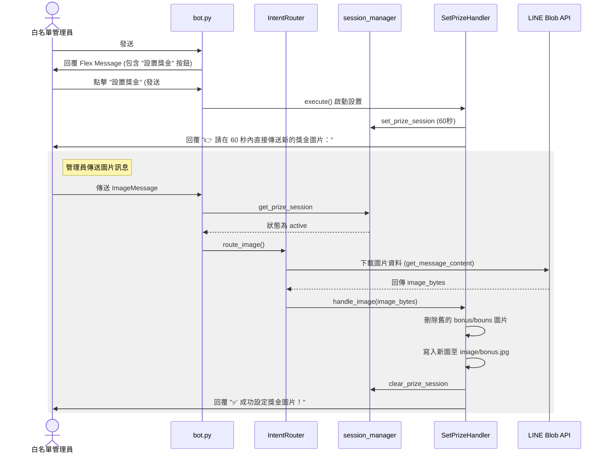

# 設計規格書：新增聯賽獎金設置功能 (Set Prize Feature)

## 1. 背景與目標
目前 Bot 中已具備讀取並展示聯賽獎金圖片的功能（於 [misc_handler.py](file:///C:/Users/HsiehLink/Python/yf_for_turtle/src/handlers/misc_handler.py) 中的 `#獎金` 指令實作），但目前尚未提供管理員直接在 LINE Bot 中動態設置與更新獎金圖片的介面。
本功能旨在提供白名單管理員一個安全、一致且易於操作的獎金圖片設置功能：
1. 在 `#設置` 主選單中新增「設置獎金」按鈕，其位置處於「設置玩家暱稱」之下，分隔線之上。
2. 啟動設定後，引導使用者在 60 秒內直接傳送新的獎金圖片。
3. 接收並下載圖片二進位內容，覆蓋儲存為該聯賽對應的 `bonus.jpg`，並清理舊的獎金圖檔以防衝突。

---

## 2. 系統架構與互動流程
下圖說明當使用者在 LINE 中點擊「設置獎金」並上傳圖片時的完整交互流程：

---

## 3. 詳細設計細節

### A. 設定選單修改 (`src/handlers/settings_handler.py`)
在設定主選單 `SettingsHandler` 的 `buttons` 陣列中，插入 `("設置獎金", "#設置獎金")`：
* 位置必須在 `("設置玩家暱稱", "#設置玩家暱稱")` 之下，分隔線 `(None, None)` 之前。

### B. 會話狀態管理 (`src/utils/session_manager.py`)
新增三個專屬於 `set_prize` 的對話狀態管理輔支函式，維持系統的 Session 快取壽命為 60 秒。

### C. 新增處理器 `SetPrizeHandler` (`src/handlers/set_prize_handler.py`)
* **屬性**：
  * `requires_whitelist = True`：僅限白名單使用。
  * `exclude_from_llm = True`：排除在 LLM 的意圖說明描述外。
* **文字指令響應**（`execute`）：
  * 確認聯賽已綁定（`LEAGUE_ID` 存在）。
  * 啟動 60 秒對話會話，並回覆：`👉 請在 60 秒內直接傳送新的獎金圖片：`。
* **圖片訊息響應**（`handle_image`）：
  * 確保儲存目錄 `data/league/{sport}/{raw_id}/image` 存在。
  * 為了防範同主檔名但不同副檔名的圖片衝突（例如已有舊的 `bonus.png`，上傳了 `bonus.jpg` 導致讀取錯誤），會先掃描並刪除目錄下所有檔名為 `bonus` 或 `bouns` 開頭的檔案。
  * 將圖片寫入為 `bonus.jpg`。
  * 成功後清除會話，回覆 `✅ 成功設定獎金圖片！`。

### D. 意圖路由修改 (`src/handlers/intent_router.py`)
* **攔截普通文字輸入**：
  * 在 `route` 方法攔截 `set_prize` 會話中的文字輸入。
  * 如果使用者輸入的文字是 `#` 或以 `#` 開頭，則主動清除會話（若為 `#` 則回覆 `已取消設定。`，若為其他指令則清除後繼續路由新指令）。
  * 如果輸入的是其他普通文字，則進行攔截，並回覆提示：`⚠️ 設置獎金模式中，請傳送獎金圖片，或輸入 # 取消設定。`，而不進行後續 LLM 分析。
* **新增圖片路由邏輯** (`route_image`)：
  * 當 `bot.py` 傳入圖片事件時，確認使用者是否處於該會話。
  * 呼叫 `MessagingApiBlob.get_message_content(message_id)` 下載圖片二進位資料。
  * 透過 `dispatcher.get_handler(SetPrizeHandler)` 獲取實例，並呼叫 `handle_image` 處理。

### E. 事件監聽擴充 (`bot.py`)
* 匯入 `SetPrizeHandler` 並註冊至 `dispatcher`。
* 匯入 `ImageMessageContent`。
* 新增 `@handler.add(MessageEvent, message=ImageMessageContent)` 監聽方法。
* 只有當發送者當前正處於 `set_prize` session 中，才調用 `intent_router.route_image`，否則一律安靜略過，保障效能與隱私。

---

## 4. 影響檔案清單
1. [src/handlers/settings_handler.py](file:///C:/Users/HsiehLink/Python/yf_for_turtle/src/handlers/settings_handler.py) (修改 Flex 按鈕)
2. [src/utils/session_manager.py](file:///C:/Users/HsiehLink/Python/yf_for_turtle/src/utils/session_manager.py) (新增 set_prize 相關會話函式)
3. [src/handlers/dispatcher.py](file:///C:/Users/HsiehLink/Python/yf_for_turtle/src/handlers/dispatcher.py) (新增 get_handler 輔助方法)
4. [src/handlers/intent_router.py](file:///C:/Users/HsiehLink/Python/yf_for_turtle/src/handlers/intent_router.py) (修改文字攔截並新增圖片路由)
5. [bot.py](file:///C:/Users/HsiehLink/Python/yf_for_turtle/bot.py) (註冊新 Handler 與監聽圖片事件)
6. [src/handlers/set_prize_handler.py](file:///C:/Users/HsiehLink/Python/yf_for_turtle/src/handlers/set_prize_handler.py) (新建立圖片設定處理器)

---

## 5. 測試設計 (Testing Plan)
1. **單元測試** (`tests/handlers/test_set_prize_handler.py`)：
   - 測試 `can_handle("#設置獎金")` 應為 `True`，其餘為 `False`。
   - 測試 `execute` 執行時是否正確回覆引導文字並建立 `set_prize` session。
   - 測試 `handle_image` 接收二進位資料時，是否能正確清除舊的 `bonus`/`bouns` 檔案，且正確將圖片寫入為 `bonus.jpg`。
2. **路由測試**：
   - 測試 `IntentRouter` 在 `set_prize` 狀態下，若收到文字非 `#` 時，是否正確回覆提示文字並不執行 LLM。
   - 測試 `IntentRouter` 在 `set_prize` 狀態下，若收到文字為 `#`，是否正確清除會話並回覆已取消。
   - 測試 `test_handlers_instruction.py` 確保 `SetPrizeHandler` 的 `instruction_desc` 能通過測試。
