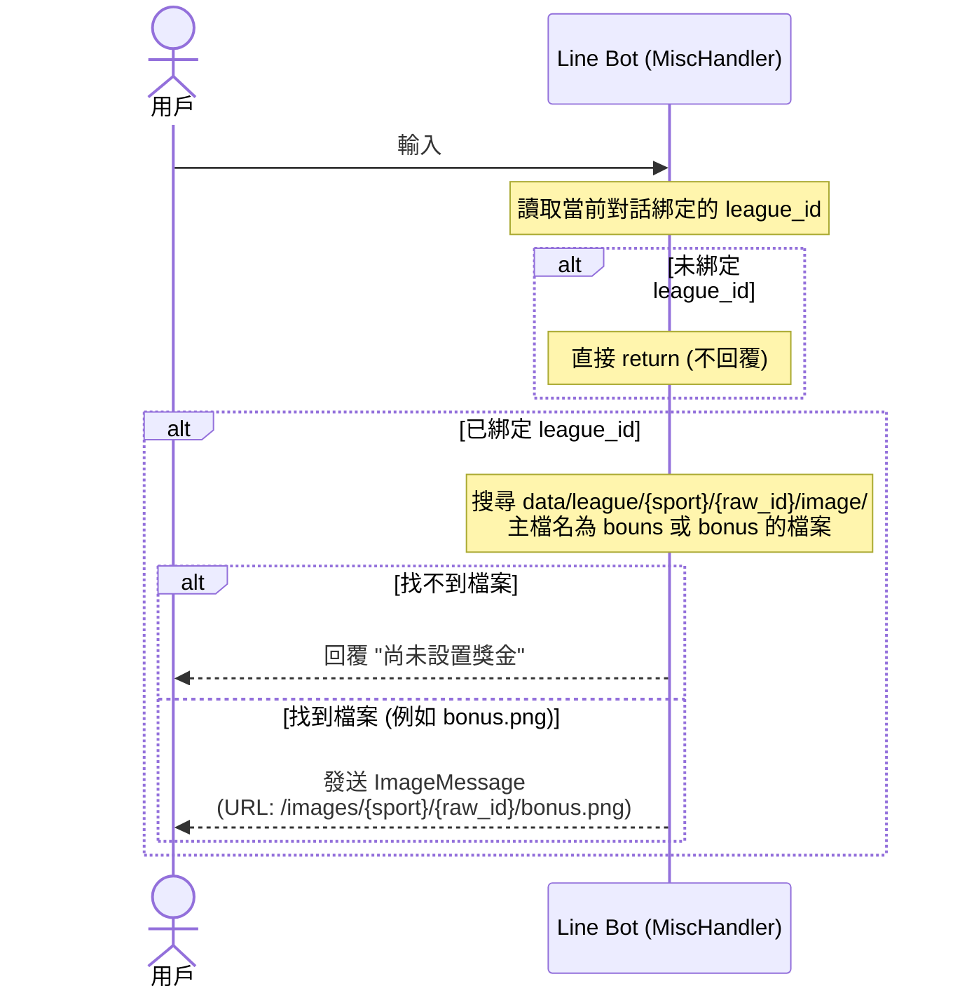

# 設計規格書：更新#獎金功能路徑與權限

## 1. 目的
重構 `#獎金` 指令。解除原先的 NBA 聯賽限制與白名單限制，使所有已綁定聯賽的群組均可使用。同時，將獎金圖片的存放路徑與 URL 改為聯賽獨立目錄，提供尚未設置獎金時的提示文字。

## 2. 功能行為與指令流程



---

## 3. 指令與限制調整

### 3.1 權限與球種限制調整
*   將現有 `MiscHandler` 內的 `mlb.l.` 限制從 `execute()` 的最上方移出。
*   將該限制應用在 `#開季`、`#選秀` 與 `#幫助` / `#help` 相關指令分支：
    ```python
    if user_text in ("#開季", "#選秀"):
        if league_id and str(league_id).startswith("mlb.l."):
            self.reply_text(event, configuration, "⚠️ 此功能目前僅支援 NBA 聯賽。")
            return
    ```

### 3.2 未綁定過濾
在 `MiscHandler.execute` 的最前端，若找不到 `league_id`，則靜默退出：
```python
if not league_id:
    return
```

---

## 4. 獎金圖片搜尋邏輯 (`_handle_prize`)

1.  **路徑解析**：
    呼叫 `parse_league_id(league_id)`，解析出當前聯賽的 `sport` 與 `raw_id`。
2.  **圖片尋找**：
    *   目錄位置：`data/league/{sport}/{raw_id}/image/`
    *   遍歷該目錄下的所有檔案。使用 `os.path.splitext` 與 `lower()` 取得小寫的主檔名。
    *   若主檔名在 `("bouns", "bonus")` 中，則選定此檔案為獎金圖片。
3.  **回覆邏輯**：
    *   **無圖片**：若目錄不存在或未找到符合名稱的檔案，回覆文字：`尚未設置獎金`。
    *   **有圖片**：
        *   使用 `SERVER_URL` 組裝 `ImageMessage` 的 URL：
            `https://{SERVER_URL}/images/{sport}/{raw_id}/{filename}`
        *   發送 `ImageMessage` 至 LINE 群組。
