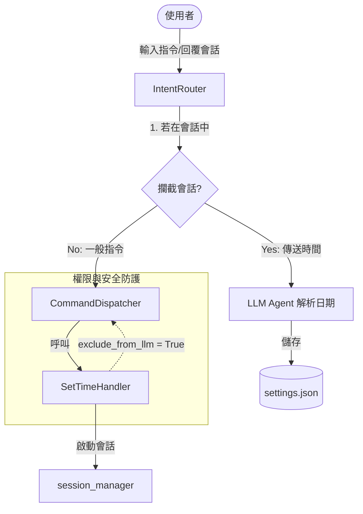

# 時間設定重構與賽季按鈕隱藏設計規格書

此設計文件定義了 Yahoo Fantasy NBA LINE Bot 在 `#設置` 選單中，實作「設置開季時間」、合併「設置選秀時間」與「設置開季時間」處理器為 `SetTimeHandler`、在賽季中隱藏這些按鈕，以及強化設定安全性（強制使用 `#` 指令，排除 LLM 語意判定）的系統架構與實作規格。

## 1. 需求與目標

1. **移除更換聯盟 ID 按鈕**：移除原設定選單中的「更換聯盟ID (即將推出)」按鈕。
2. **新增開季時間設定**：
   * 支援手動設定開季時間，格式與選秀時間一致為 `YYYY-MM-DD HH:MM`（例如 `2026-10-22 08:00`）。
   * 此功能僅限在休賽季期間進行設定，設定資料將物理儲存至各聯賽目錄下的 `settings.json` 中，使用 Key 名稱為 `SEASON_START_DATE`。
3. **賽季中隱藏時間設定按鈕**：
   * 原本「設置選秀時間」在賽季中會呈現灰色不可點擊按鈕。重構後，在非休賽季（賽季中）期間，設定選單應**直接完全隱藏**「設置選秀時間」與「設置開季時間」按鈕。
4. **設定安全性強化（不使用 LLM 語意判定）**：
   * 所有設定類功能（如設置聯賽ID、設置選秀/開季時間、設置玩家暱稱、設置獎金等）強制使用者必須打以 `#` 開頭的實體指令（如 `#設置開季時間`）方可觸發，**不得**被 LLM 語意分類判定觸發。

---

## 2. 系統架構與變動範圍

### 2.1 設定選單按鈕邏輯變更 (`SettingsHandler`)
* 檔案路徑：`src/handlers/settings_handler.py`
* 移除 `("更換聯盟ID (即將推出)", "")` 按鈕。
* 讀取聯賽元數據以判斷目前是否為休賽季（`is_offseason`）。
* **按鈕清單配置**：
  * **休賽季 (`is_offseason = True`)**：
    * `("設置選秀時間", "#設置選秀時間")`
    * `("設置開季時間", "#設置開季時間")`
    * `("設置玩家暱稱", "#設置玩家暱稱")`
    * `("設置獎金", "#設置獎金")`
    * `(None, None)` (分隔線)
    * `("移除聯盟ID", "#移除聯盟ID")`
  * **賽季中 (`is_offseason = False`)**：
    * `("設置玩家暱稱", "#設置玩家暱稱")`
    * `("設置獎金", "#設置獎金")`
    * `(None, None)` (分隔線)
    * `("移除聯盟ID", "#移除聯盟ID")`
    * *(註：「設置選秀時間」與「設置開季時間」在此模式下完全不加入按鈕列表中)*

### 2.2 會話管理擴充 (`session_manager.py`)
* 檔案路徑：`src/utils/session_manager.py`
* 新增三個 Helper 函數以管理開季時間會話，會話的生命週期預設為 60 秒：
  * `set_season_start_time_session(user_id: str, data: any, duration_sec: int = 60) -> None`
  * `get_season_start_time_session(user_id: str) -> any | None`
  * `clear_season_start_time_session(user_id: str) -> None`

### 2.3 重構並合併時間設定處理器 (`SetTimeHandler`)
* 物理刪除原有的 `src/handlers/set_draft_time_handler.py`。
* 新增檔案：`src/handlers/set_time_handler.py`
* **類別屬性與設定**：
  * `self.requires_whitelist = True` (僅限白名單使用)
  * `self.exclude_from_llm = True` (🎯 確保此 Handler 排除在傳給 LLM 的指令說明之外，落實強制 `#` 指令觸發)
* **匹配條件 (`can_handle`)**：
  * `user_text.strip() in ["#設置選秀時間", "#設置開季時間"]`
* **執行邏輯 (`execute`)**：
  * 若用戶輸入 `#設置選秀時間`：
    * 呼叫 `set_draft_time_session(user_id, True, duration_sec=60)`。
    * 回覆提示語：「👉 請在 60 秒內直接輸入新的選秀時間（格式：YYYY-MM-DD HH:MM）：\n例如：2026-10-15 19:30」
  * 若用戶輸入 `#設置開季時間`：
    * 呼叫 `set_season_start_time_session(user_id, True, duration_sec=60)`。
    * 回覆提示語：「👉 請在 60 秒內直接輸入新的開季時間（格式：YYYY-MM-DD HH:MM）：\n例如：2026-10-22 08:00」

### 2.4 調整 `bot.py` 註冊項目
* 檔案路徑：`bot.py`
* 將 `dispatcher.register(SetDraftTimeHandler())` 替換為 `dispatcher.register(SetTimeHandler())`。

### 2.5 意圖路由器會話攔截與解析 (`IntentRouter`)
* 檔案路徑：`src/handlers/intent_router.py`
* **活躍會話放行**：在 `should_process` 攔截器中，新增對 `get_season_start_time_session(user_id)` 的判斷，確保會話進行中的文字不會被靜默過濾。
* **對話會話攔截處理 (`route`)**：
  * 攔截 `get_season_start_time_session(user_id)`。
  * 若用戶發送 `#`（或 `#` 開頭指令），則調用 `clear_season_start_time_session(user_id)` 並跳出，不修改任何設定。
  * 否則，調用 `self.llm_agent.parse_draft_date(user_text)`（可重複使用已有的 LLM 解析機制，將使用者輸入的自然語言解析為 `YYYY-MM-DD HH:MM` 標準格式）。
  * 解析成功後：
    * 呼叫 `self._update_league_settings({"SEASON_START_DATE": date_val})`。
    * 清除開季時間會話並回覆：「✅ 成功將開季時間修改為：{date_val}」。
  * 解析失敗則提示重新輸入或輸入 `#` 取消。

---

## 3. 安全防護機制（強制實體指令）

1. **LLM 排除機制**：
   `CommandDispatcher.get_all_instruction_descs()` 會自動排除標記有 `exclude_from_llm = True` 的 Handler。
   本次設計中，`SetTimeHandler` 的 `exclude_from_llm` 被設為 `True`。因此在 `IntentRouter._handle_llm_flow` 中，該 Handler 的指令與說明不會進入 LLM 意圖分類 Prompt。
2. **實際成效**：
   即使使用者對著 AI 輸入「幫我設定開季時間」或「我想修改選秀時間」，由於 LLM 提示詞中不存在這些指令，LLM 意圖路由器絕對不會將其匹配並轉化為實體指令。使用者必須強制輸入具備前綴 `#` 的 `#設置選秀時間` 或 `#設置開季時間` 才能被 `CommandDispatcher` 正常分發執行。

---

## 4. 測試覆蓋規格

### 4.1 設定選單按鈕測試 (`tests/handlers/test_settings_handler.py`)
* 測試當 `is_offseason = True`（休賽季）時：
  * 驗證按鈕列表中含有「設置選秀時間」（指令為 `#設置選秀時間`）與「設置開季時間」（指令為 `#設置開季時間`）。
  * 驗證不包含「更換聯盟ID (即將推出)」。
* 測試當 `is_offseason = False`（賽季中）時：
  * 驗證按鈕列表中**不包含**「設置選秀時間」與「設置開季時間」按鈕。
  * 驗證其餘設定選項（設置玩家暱稱、設置獎金、移除聯盟ID）皆正常呈現。

### 4.2 時間設定處理器測試 (`tests/handlers/test_set_time_handler.py`)
* 測試 `SetTimeHandler.can_handle` 遇到 `#設置選秀時間` 與 `#設置開季時間` 時皆返回 `True`，其餘無前綴或無效指令返回 `False`。
* 測試白名單權限限制。
* 測試發送 `#設置選秀時間` 能正常調用 `set_draft_time_session` 並回覆引導提示。
* 測試發送 `#設置開季時間` 能正常調用 `set_season_start_time_session` 並回覆引導提示。

### 4.3 意圖路由器開季會話攔截測試 (`tests/test_intent_router.py`)
* 測試當使用者處於開季時間會話時：
  * 輸入自然語言時間文字，驗證調用 LLM 解析，並將解析後的值更新至 settings.json 的 `SEASON_START_DATE` 中，最後清理會話。
  * 輸入 `#` 時，驗證直接清除會話，且不修改任何檔案。
