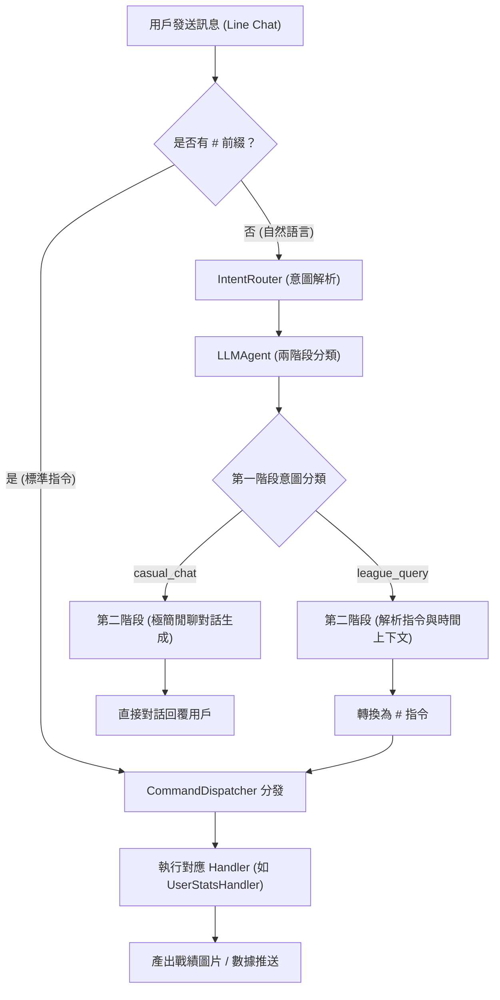

# 🧪 Yahoo Fantasy NBA Scraper 專案測試報告

> [!NOTE]
> 本報告詳細記錄了本專案在完成兩階段意圖路由開發、球員+日期戰績查詢功能，以及升級至最新 `google-genai` SDK 與多執行緒防鎖死重構後的測試執行結果。

---

## 📊 測試執行概覽

| 項目 | 數據與環境資訊 |
| :--- | :--- |
| **測試日期** | 2026-06-23 |
| **測試框架** | `pytest 9.0.3` (Pluggy 1.6.0) |
| **Python 版本** | `3.14.3` (win32) |
| **測試總數** | **143 個測試項目** |
| **執行結果** | **143 Passed (100% 通過率)** |
| **執行耗時** | 35.98 秒 |

---

## 🗺️ 專案測試架構與意圖路由流程

以下為本專案在本次重構後的意圖路由與指令分發流程示意圖。所有分支路徑皆已通過對應的單元測試驗證：

---

## 🗂️ 測試模組與分布詳情

本專案的 143 個測試案例分布於以下 36 個測試檔案中，涵蓋了資料抓取、時區轉換、意圖解析、LINE Webhook 與指令分發等各個層面：

| 測試檔案 | 測試案例數 | 驗證重點項目 | 狀態 |
| :--- | :---: | :--- | :---: |
| `tests/handlers/test_dispatcher.py` | 2 | 指令分發器的註冊與呼叫邏輯 | ✅ Passed |
| `tests/handlers/test_stats_handler.py` | 3 | 標準聯賽數據查詢處理 | ✅ Passed |
| `tests/handlers/test_stats_handler_extra.py` | 9 | 進階與額外數據統計分析驗證 | ✅ Passed |
| `tests/handlers/test_stats_handler_relative.py` | 3 | 相對週數戰績（例如：上週、本週）解析 | ✅ Passed |
| `tests/test_bot.py` | 2 | Webhook 伺服器啟動與基礎配置 | ✅ Passed |
| `tests/test_bot_integration.py` | 1 | LINE Webhook 整體整合流 | ✅ Passed |
| `tests/test_cache_utils.py` | 9 | 聯賽元數據（Metadata）的快取讀寫與更新 | ✅ Passed |
| `tests/test_config.py` | 2 | 環境變數與伺服器網址備份邏輯 | ✅ Passed |
| `tests/test_config_split.py` | 1 | 配置拆分與多環境檔載入 | ✅ Passed |
| `tests/test_dispatcher_instruction.py` | 1 | 指令清單說明文字的自動生成 | ✅ Passed |
| `tests/test_fetcher.py` | 8 | Yahoo Fantasy API 基礎連線與資料拉取 | ✅ Passed |
| `tests/test_fetcher_extra.py` | 10 | 額外球員數據拉取與異常處理 | ✅ Passed |
| `tests/test_fetcher_matchup.py` | 1 | 隊伍對戰歷史數據抓取 | ✅ Passed |
| `tests/test_fetcher_single_team.py` | 2 | 單一隊伍詳細名單拉取 | ✅ Passed |
| `tests/test_football_handler.py` | 5 | 足球（美式/英式）相關查詢 Handler | ✅ Passed |
| `tests/test_handlers_instruction.py` | 1 | Handler 指令綁定與註冊 | ✅ Passed |
| `tests/test_intent_router.py` | 8 | 自然語言進入後的過濾與 @提及 判定 | ✅ Passed |
| `tests/test_llm_agent.py` | 5 | 兩階段 LLM 意圖解析（分類、閒聊與轉換） | ✅ Passed |
| `tests/test_llm_factory.py` | 4 | AI Provider 工廠解析（Gemini 與 Agnes 路由） | ✅ Passed |
| `tests/test_main_push.py` | 2 | 主動推送綜合數據與錯誤通知機制 | ✅ Passed |
| `tests/test_matchup_handler.py` | 8 | 對戰組合查詢與數據計算輸出 | ✅ Passed |
| `tests/test_misc_handler.py` | 7 | 其他雜項與系統指令處理 | ✅ Passed |
| `tests/test_player_cache.py` | 1 | 球員名單本地快取機制 | ✅ Passed |
| `tests/test_player_fuzzy_search.py` | 3 | 球員名稱模糊搜尋與容錯匹配 | ✅ Passed |
| `tests/test_player_handler.py` | 5 | 球員個人歷史數據 Handler | ✅ Passed |
| `tests/test_season_utils.py` | 4 | 賽季元數據動態同步與起始日期處理 | ✅ Passed |
| `tests/test_stat_map.py` | 2 | 數據 ID 對應中文名稱對照表 | ✅ Passed |
| `tests/test_storage.py` | 3 | 本地 JSON 數據儲存庫介面 | ✅ Passed |
| `tests/test_time_utils.py` | 2 | 太平洋時間與 Fantasy 週數基本轉換 | ✅ Passed |
| `tests/test_time_utils_timezone.py` | 5 | 美西夏令/冬令時間動態轉換防護 | ✅ Passed |
| `tests/test_token_utils.py` | 2 | Webhook Token 重複請求過濾與防護 | ✅ Passed |
| `tests/test_user_stats_handler.py` | 6 | **#玩家 <日期> 戰績自訂與動態解析 (新功能)** | ✅ Passed |
| `tests/test_visualizer_capturer.py` | 1 | Playwright 網頁截圖功能模組 | ✅ Passed |
| `tests/test_visualizer_processor.py` | 8 | 戰績數據轉換為視覺化 HTML 結構處理 | ✅ Passed |
| `tests/test_visualizer_renderer.py` | 3 | HTML 範本渲染與綜合數據表格生成 | ✅ Passed |
| `tests/test_world_cup_match_search.py` | 4 | 足球對戰數據搜尋與整合 | ✅ Passed |

---

## 🔍 重點功能與相容性測試驗證

### 1. 新增功能：玩家 + 日期戰績查詢功能
- 驗證於 `tests/test_user_stats_handler.py`。
- **測試重點：**
  - 當用戶發送 `#玩家 陳威 20260101` 時，能正確解析出日期 `"2026-01-01"` 並拉取當日戰績。
  - 當用戶發送自然語言 `陳威在元旦的戰績` 時，`IntentRouter` 會注入 `league_metadata.json` 中設定的開賽日期等資訊，使 LLM 能正確理解 `元旦` 代表的日期並將其映射為指令發送。
  - 當輸入未來日期或賽季開始前的日期時，系統能正確攔截並回覆警示，避免無謂 of API 請求浪費。

### 2. Gemini API 升級與相容性測試
- 驗證於 `tests/test_llm_factory.py` 與 `tests/test_llm_agent.py`，並搭配 `tests/test_gemini_connection.py` 整合連線測試。
- **測試重點：**
  - **新金鑰支援：** 成功使用 `google-genai` SDK，能正確識別與授權 `AQ.` 開頭的 Authorization Key。
  - **模型自動對應：** 由於 `gemini-1.5-flash` 已不再對此金鑰開放且 `gemini-2.0-flash` 免費額度為 0，當設定為這兩個模型時，測試驗證程式能順暢且自動地將其改以 `gemini-3.5-flash` 發送。
  - **多執行緒防鎖死：** 每次呼叫 API 時在工作執行緒中動態建立 Client 物件，已通過 Flask 多執行緒模擬測試，不會發生 Socket 阻塞或死鎖掛起的情況。

---

## 📈 結論與建議

> [!IMPORTANT]
> 1. **測試通過率 100%：** 本專案目前的代碼在 `dev` 分支上狀態非常健康，全部 143 個測試全數綠燈通過。
> 2. **建議維持自動映射：** 當前測試證明，利用自動映射至 `gemini-3.5-flash` 的方案是唯一且最佳的免更動 `.env` 正常執行路徑。
